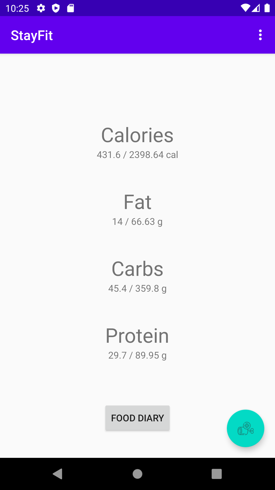
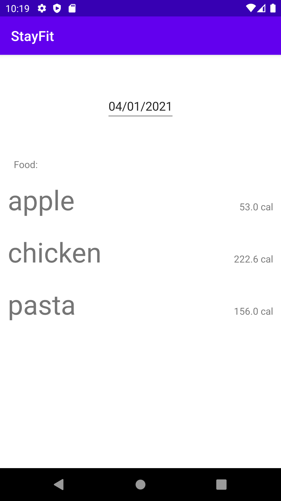
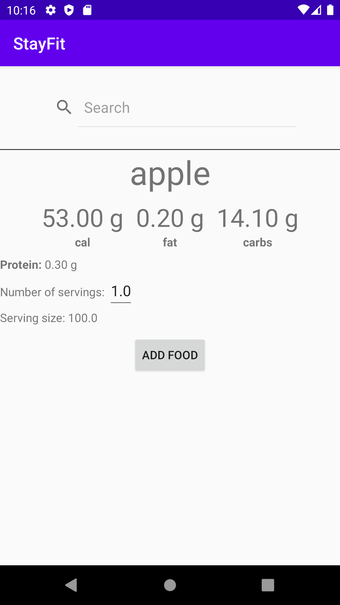
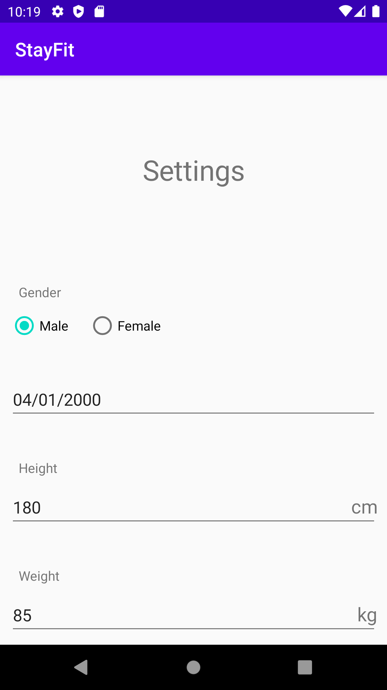

# StayFit
Aplikacija je bila narejena za seminarsko nalogo pri predmetu Elektronsko in mobilno poslovanje. Narejena je v programskem jeziku Java za operacijski sistem Android. Uporabniku omogoča štetje in sledenje kalorij ter nekaterih drugih parametrov povezanih s prehrano.

# Api
Aplikacija se za pridobitev podatkov o hrani povezuje z API-jem CalorieNinjas. Za iskan element vrne podatke o prehrani ( teh podatkov je nekoliko več, nekaterih podatkov ne uporabljam). API omogoča tudi iskanje več elementov naenkrat, ter k vsakemu lahko dodamo količino. Podatke vrača v formatu Json.
